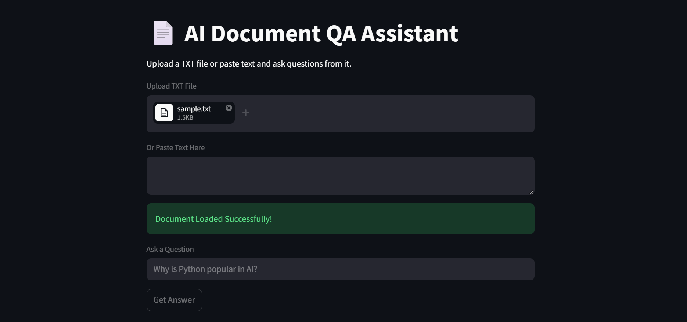
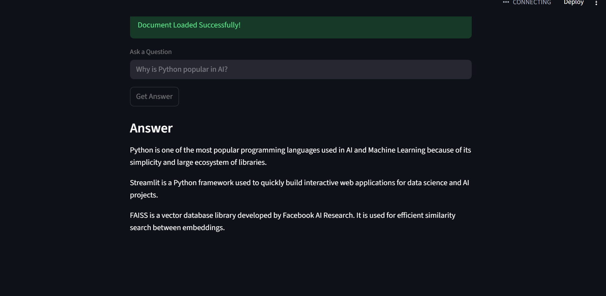

# AI Document QA Assistant

An AI-powered document question answering assistant built using Python and Streamlit.

## Features

- Upload TXT documents
- Ask questions from uploaded content
- Semantic search using embeddings
- Vector similarity search with FAISS
- Beginner-friendly AI project

## Tech Stack

- Python
- Streamlit
- FAISS
- Sentence Transformers
- Transformers

## How It Works

1. Upload a document
2. Text is split into chunks
3. Embeddings are generated
4. FAISS performs semantic similarity search
5. Most relevant content is returned as answer

## Run Locally

```bash
py -3.11 -m streamlit run app.py
```

## Future Improvements

- PDF upload support
- Better local LLM responses
- Chat history
- Multiple document support

## Screenshots

### Uploaded Document



### Answer Generated

